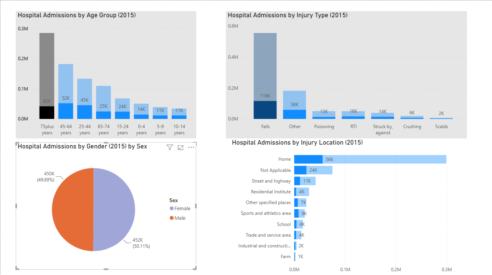

# nhs-accident-analysis-2015
Analysis of NHS admissions and deaths data using Big Query, SQL and Power BI.
## Dashboard

The dashboard was built in Power BI to analyse accident-related hospital admissions in 2015.

## Key Findings

### Finding 1: Injury Types

Falls were the leading cause of injury-related hospital admissions in 2015, with 555,200 admissions. This was significantly higher than all other injury categories, indicating that fall prevention could have a major impact on reducing hospital admissions.

### Finding 2: Age Groups

The 75+ years age group recorded the highest number of hospital admissions, with 285,104 admissions. This suggests that injury prevention strategies aimed at older adults could significantly reduce hospital admissions.

### Finding 3: Gender

Hospital admissions were distributed almost equally between females and males. Females recorded 451,824 admissions compared with 449,784 admissions for males, suggesting that injury-related admissions affected both sexes at a similar rate.

### Finding 4: Injury Location

The majority of injury-related hospital admissions occurred in unspecified locations and at home. Home-related injuries accounted for 299,336 admissions, suggesting that injury prevention efforts within domestic environments could significantly reduce hospital admissions.
