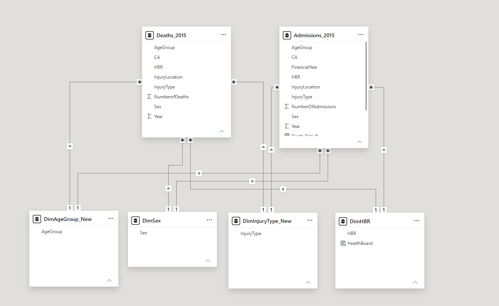
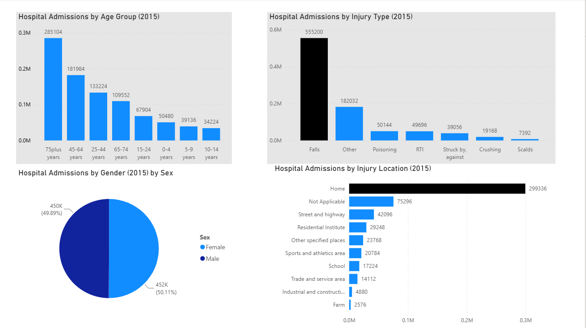
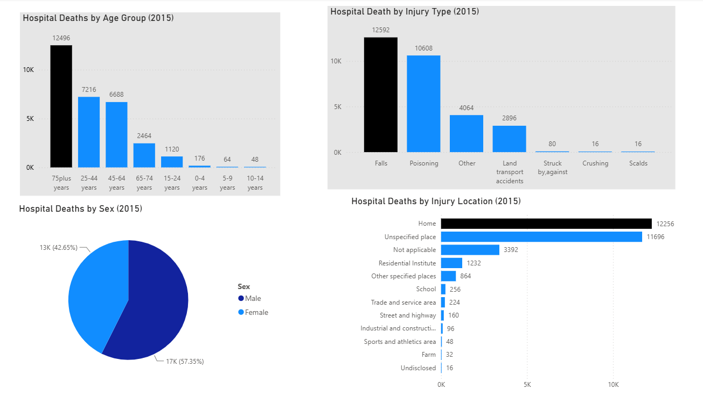
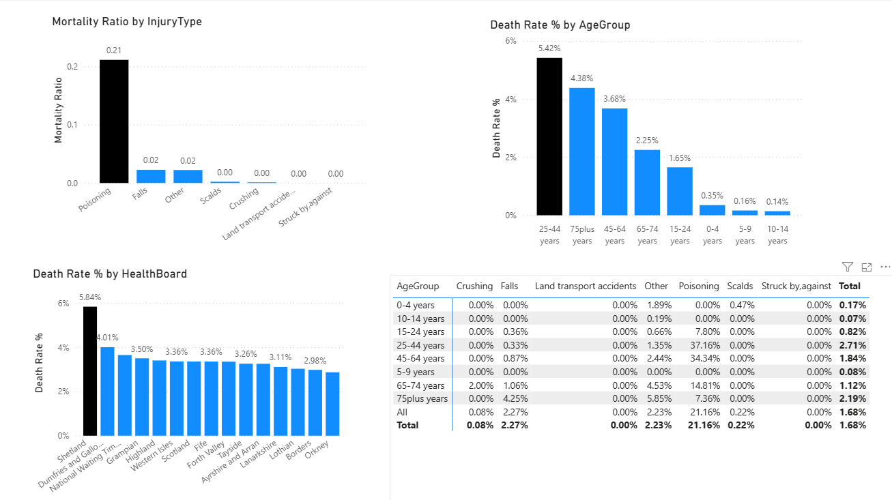

# NHS Accident Analysis 2015

## Project Overview

This project analyses NHS Scotland accident-related admissions and deaths for 2015 using Power BI. The objective was to identify accident patterns across age groups, sex, injury types, injury locations, and Health Boards while applying dimensional modelling, DAX calculations, and data visualisation techniques.

The project demonstrates skills in data modelling, Power BI dashboard development, DAX measures, analytical reporting, and GitHub documentation.

---

## Tools Used

* Power BI
* DAX
* SQL
* GitHub

---

## Business Questions

This analysis aims to answer the following questions:

1. Which injury types result in the highest number of hospital admissions?
2. Which injury types result in the highest number of deaths?
3. Which age groups experience the greatest accident burden?
4. Which injury categories have the highest mortality ratio?
5. How do accident outcomes vary across NHS Scotland Health Boards?

---

## Dataset

The project uses NHS Scotland accident statistics for 2015 consisting of two aggregated datasets.

### Admissions Dataset

* Age Group
* Sex
* Injury Type
* Injury Location
* Health Board (HBR)
* Number of Admissions

### Deaths Dataset

* Age Group
* Sex
* Injury Type
* Injury Location
* Health Board (HBR)
* Number of Deaths

---

## Data Source

The dataset used in this project was obtained from NHS Scotland open data resources and contains accident-related admissions and deaths for 2015.

The data was used for educational and portfolio purposes only.

**Source:** [Insert NHS Scotland dataset URL]

---

## Data Model

The project follows a Star Schema design.

### Fact Tables

* Admissions_2015
* Deaths_2015

### Dimension Tables

* DimAgeGroup
* DimSex
* DimHBR
* DimInjuryType

Dimension tables were created using values from both fact tables to ensure complete category coverage and prevent unmatched records from appearing as blank values in reports.

### Data Model Screenshot



---

## Power BI Dashboard

### Admissions Analysis




### Deaths Analysis



### Mortality Ratio Analysis



---

## Measures

The following DAX measures were created to support the analysis.

### Total Admissions

```DAX
Total Admissions =
SUM(Admissions_2015[NumberOfAdmissions])
```

### Total Deaths

```DAX
Total Deaths =
SUM(Deaths_2015[NumberOfDeaths])
```

### Mortality Ratio

```DAX
Mortality Ratio =
DIVIDE(
    [Total Deaths],
    [Total Admissions],
    0
)
```

### Admissions per Death

```DAX
Admissions per Death =
DIVIDE(
    [Total Admissions],
    [Total Deaths],
    0
)
```

---

## Key Findings

### Admissions Analysis

* Falls were the leading cause of hospital admissions.
* Individuals aged 75 years and over recorded the highest number of admissions.
* Home was the most common injury location.
* Admissions were relatively evenly distributed between males and females.

### Deaths Analysis

* Individuals aged 75 years and over recorded the highest number of deaths.
* Falls were responsible for the largest number of accident-related deaths.
* Males accounted for a higher proportion of deaths than females.
* Home was the most common known location of fatal accidents.

### Mortality Ratio Analysis

* Poisoning recorded the highest deaths-to-admissions ratio among injury categories.
* Mortality ratios varied across age groups and Health Boards.
* Regional differences were observed between NHS Scotland Health Boards.

---

## Project Limitations

The admissions and deaths datasets were provided as separate aggregated datasets and linked through shared dimensions including Age Group, Sex, Health Board, and Injury Type.

As a result, the Mortality Ratio measure used in this project should be interpreted as a category-level ratio of deaths to admissions rather than a patient-level mortality rate. The analysis highlights relative patterns within categories but cannot determine whether individual admissions resulted in death.

This limitation was considered when interpreting the results and drawing conclusions from the dashboard.

---

## Repository Structure

```text
nhs-accident-analysis-2015
│
├── Images
│   ├── admissions_dashboard.png
│   ├── deaths_dashboard.png
│   ├── mortality_ratio_dashboard.png
│   └── data_model.png
│
├── PowerBI
│   └── NHS Accident Analysis 2015.pbix
│
├── SQL
│
└── README.md
```

---

## Skills Demonstrated

* Data Modelling
* Star Schema Design
* Power BI Dashboard Development
* DAX Calculations
* Data Visualisation
* Analytical Reporting
* GitHub Documentation

This project demonstrates the end-to-end workflow of a data analyst, including data modelling, measure creation, dashboard development, analytical interpretation, and documentation.

---

## Author

**Sharon Karmal Louis**

MSc Renewable Energy | Aspiring Data Analyst

LinkedIn: https://www.linkedin.com/in/sharonkarmallouis/

GitHub: https://github.com/SharonkarmalLouis
